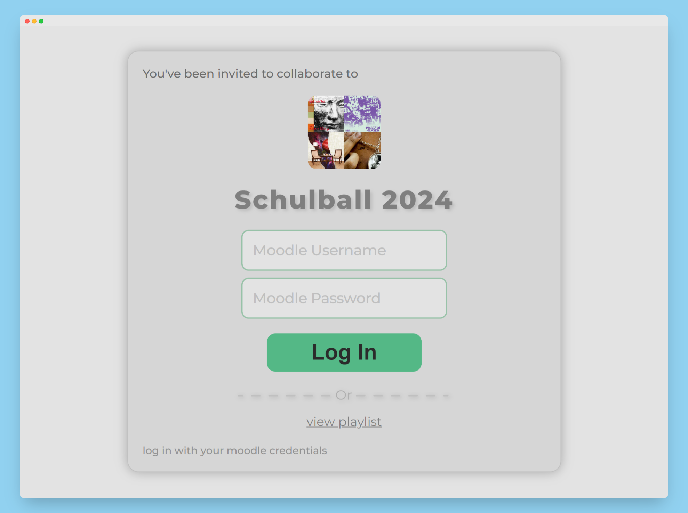

# SpotifyAPI Keycloak Theme

## Overview
The Voting Tool currently known as "SpotifyAPI" uses [Keycloak](https://www.keycloak.org/) for authorization. This theme extends Keycloaks default theme for the login page to help by creating a better user experience for "SpotifyAPI" users.

## Deployment
Simply copy the folder [spotifyapi](spotifyapi) to the `themes` directory located in `opt/keycloak/themes`

## Note
This Theme is currently under construction and uses references redirecting to "localhost" pages!

## Screenshots

